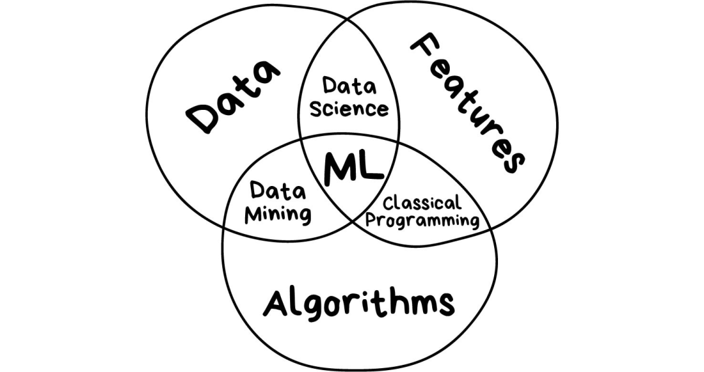

# 机器学习的三个部分

## 1. 数据
获取数据有两种主要途径——手动或者自动。手动采集的数据混杂的错误少，但要耗费更多的时间——通常花费也更多，可以自己采集也可以想办法发动群众的力量，如google的ReCaptcha方法。自动化的方法相对便宜，你可以搜集一切能找到的数据，但数据质量可能不够好。

好的数据集真的很难获取，它们是如此重要，以至于有的公司甚至可能开放自己的算法，但很少公布数据集。

## 2. 特征
特征也可以称为“参数”或者“变量”，比如汽车行驶公里数、用户性别、股票价格、文档中的词频等。换句话说，特征是机器需要考虑的因素。

如果数据是以表格的形式存储，特征就对应着列名，这种情形比较简单。但如果是100GB的猫的图片呢？我们不能把每个像素都当做特征。这就是为什么选择适当的特征通常比机器学习的其他步骤花更多时间的原因，特征选择也是误差的主要来源。人性中的主观倾向，会让人去选择自己喜欢或者感觉“更重要”的特征——这是需要避免的。

## 3. 算法
算法是最显而易见的部分。任何问题都可以用不同的方式解决。你选择的方法会影响到最终模型的准确性、性能以及大小。需要注意一点：如果数据质量差，即使采用最好的算法也无济于事。这被称为“垃圾进，垃圾出”(garbae in - garbage out,GIGO)。所以，在把大量心思花到正确率之前，应该获取更多更好的数据。

# 经典机器学习算法

一半的互联网公司都在研究这些算法，很多大型科技公司非常追捧神经网络，原因显而易见，对于这些大型企业而言，2%的准确率提升意味着增加20亿的收入。但是公司业务体量小时，就没那么重要了。我听说有团队花了1年时间来为他们的电商网站开发新的推荐算法，事后才发现网站上99%的流量都来自搜索引擎——他们搞出来的算法毫无用处，毕竟大部分用户甚至都不会打开主页。

尽管经典算法被广泛使用，其实原理很简单，你可以很容易地解释给一个蹒跚学步的孩子听。它们就像是基本的算术——我们每天都在用，甚至连想都不想。下面给大家讲一些经典的机器学习算法。

经典机器学习通常分为两类：有监督学习和无监督学习。

在“有监督学习”中，有一个“监督者”或者“老师”提供给机器所有的答案来辅助学习，比如图片中是猫还是狗。“老师”已经完成数据集的划分——标注“猫”或“狗”，机器就使用这些示例数据来学习，逐个学习区分猫或狗。

无监督学习就意味着机器在一堆动物图片中独自完成区分谁是谁的任务。数据没有事先标注，也没有“老师”，机器要自行找出所有可能的模式。后文再讨论这些。

## 1. 有监督学习
很明显，有“老师”在场时，机器学的更快，因此现实生活中有监督学习更常用到。有监督学习分为分类和回归两类。

  ### 1） 分类(classification)，预测一个对象所属的类别
  基于事先知道的一种属性来对物体划分类别，比如根据颜色来对袜子归类，根据语言对文档分类，根据风格来划分音乐。

  分类算法常用于：过滤垃圾邮件；语言检测；查找相似文档；情感分析；识别手写字母或数字；欺诈侦测。
  
  常用的算法：朴素贝叶斯、决策树、Logistic回归、K近邻、支持向量机

例子：

  朴素贝叶斯算法广泛应用于垃圾邮件过滤。机器分别统计垃圾邮件和正常邮件中出现的“伟哥”等字样出现的频次，然后套用贝叶斯方程乘以各自的概率，再对结果求和——哈，机器就完成学习了。后来，垃圾邮件制造者学会了如何应对贝叶斯过滤器——在邮件内容后面添加很多“好”词——这种方法被讽称为“贝叶斯中毒”。朴素贝叶斯作为最优雅且是第一个实用的算法而载入历史，不过现在有其他算法来处理垃圾邮件过滤问题。

  决策树广泛应用于高责任场景：诊断、医药以及金融领域。最广为人知的两种决策树算法是 CART 和 C4.5。如今，很少用到纯粹的决策树算法。不过，它们是大型系统的基石，决策树集成之后的效果甚至比神经网络还要好。

  按理说，支持向量机应该是最流行的分类方法。只要是存在的事物都可以用它来分类：对图片中的植物按形状归类，对文档按类别归类等。SVM背后的思想很简单——它试图在数据点之间绘制两条线，并尽可能最大化两条线之间的距离。

  分类算法有一个非常有用的场景——异常检测，如果某个特征无法分配到所有类别上，我们就把它标出来。现在这种方法已经用于医学领域——MRI(磁共振成像)中，计算机会标记检测范围内所有的可疑区域或者偏差。股票市场使用它来检测交易人的异常行为以此来找到内鬼。在训练计算机分辨哪些事物是正确时，我们也自动教会其识别哪些事物是错误的。

  经验法则表明，数据越复杂，算法就越复杂。对于文本、数字、表格这样的数据，我会选择经典方法来操作。这些模型较小，学习速度更快，工作流程也更清晰。对于图片、视频以及其他复杂的大数据，我肯定会研究神经网络。

  就在5年前，你还可以找到基于SVM的人脸分类器。现在，从数百个预训练好的神经网络模型中挑选一个模型反而更容易。不过，垃圾邮件过滤器没什么变化，它们还是用SVM编写的，没什么理由去改变它。甚至我的网站也是用基于SVM来过滤评论中的垃圾信息的。

  ### 2） 回归(regression)，预测数轴上的一个特定点
画一条线穿过这些点，嗯~这就是机器学习：回归。

目前用于：股票价格预测；供应和销售量分析；医学诊断；计算时间序列相关性

常见的回归算法有：线性回归、多项式回归

“回归”算法本质上也是“分类”算法，只不过预测的是不是类别而是一个数值。比如根据行驶里程来预测车的价格，估算一天中不同时间的交通量，以及预测随着公司发展供应量的变化幅度等。处理和时间相关的任务时，回归算法可谓不二之选。

回归算法备受金融或者分析行业从业人员青睐。它甚至成了Excel的内置功能，整个过程十分顺畅——机器只是简单地尝试画出一条代表平均相关的线。不过，不同于一个拿着笔和白板的人，机器是通过计算每个点与线的平均间隔这样的数学精确度来完成的这件事。

如果画出来的是直线，那就是“线性回归”，如果线是弯曲的，则是“多项式回归”。它们是回归的两种主要类型。其他类型就比较少见了。不要被Logistics回归这个“害群之马”忽悠了，它是分类算法，不是回归。

不过，把“回归”和“分类”搞混也没关系。一些分类器调整参数后就变成回归了。除了定义对象的类别外，还要记住对象有多么的接近该类别，这就引出了回归问题。

## 2. 无监督学习

### 聚类

“机器会选择最好的方式，基于一些未知的特征将事物区分开来。”

聚类算法目前用于：市场细分(顾客类型，忠诚度)；合并地图上邻近的点；图像压缩；分析和标注新的数据；检测异常行为

常见算法：K均值聚类、Mean-Shift、DBSCAN

聚类是在没有事先标注类别的前提下来进行类别划分。好比你记不住所有袜子的颜色时照样可以对袜子进行分类。聚类算法试图找出相似的事物(基于某些特征)，然后将它们聚集成簇。那些具有很多相似特征的对象聚在一起并划分到同一个类别。有的算法甚至支持设定每个簇中数据点的确切数量。

这里有个示范聚类的好例子——在线地图上的标记。当你寻找周围的素食餐厅时，聚类引擎将它们分组后用带数字的气泡展示出来。不这么做的话，浏览器会卡住——因为它试图将这个时尚都市里所有的300家素食餐厅绘制到地图上。

就像分类算法一样，聚类可以用来检测异常。用户登陆之后的有不正常的操作？让机器暂时禁用他的账户，然后创建一个工单让技术支持人员检查下是什么情况。说不定对方是个“机器人”。我们甚至不必知道“正常的行为”是什么样，只需把用户的行为数据传给模型，让机器来决定对方是否是个“典型的”用户。这种方法虽然效果不如分类算法那样好，但仍值得一试。

# 降维（dimension reduction）
将特定的特征组装成更高级的特征

“降维”算法目前用于：推荐系统；漂亮的可视化；主题建模和查找相似文档；假图识别；风险管理。

常用的“降维”算法：主成分分析、奇异值分解、潜在狄里克雷特分配、潜在语义分析、t-SNE (用于可视化)

早年间，“硬核”的数据科学家会使用这些方法，他们决心在一大堆数字中发现“有趣的东西”。Excel图表不起作用时，他们迫使机器来做模式查找的工作。于是他们发明了降维或者特征学习的方法。

对人们来说，相对于一大堆碎片化的特征，抽象化的概念更加方便。举个例子，我们把拥有三角形的耳朵、长长的鼻子以及大尾巴的狗组合出“牧羊犬”这个抽象的概念。相比于特定的牧羊犬，我们的确丢失了一些信息，但是新的抽象概念对于需要命名和解释的场景时更加有用。作为奖励，这类“抽象的”模型学习速度更快，训练时用到的特征数量也更少，同时还减少了过拟合。

这些算法在“主题建模”的任务中能大显身手。我们可以从特定的词组中抽象出他们的含义。潜在语义分析(LSA)就是搞这个事情的，LSA基于在某个主题上你能看到的特定单词的频次。比如说，科技文章中出现的科技相关的词汇肯定更多些，或者政治家的名字大多是在政治相关的新闻上出现，诸如此类。

我们可以直接从所有文章的全部单词中来创建聚类，但是这么做就会丢失所有重要的连接(比如，在不同的文章中battery 和 accumulator的含义是一样的)，LSA可以很好地处理这个问题，所以才会被叫做“潜在语义”。

因此，需要把单词和文档连接组合成一个特征，从而保持其中的潜在联系——人们发现奇异值分解(SVD)能解决这个问题。那些有用的主题簇很容易从聚在一起的词组中看出来。

# 关联规则学习(Association rule learning)
在订单流水中查找模式

“关联规则”目前用于：预测销售和折扣；分析“一起购买”的商品；规划商品陈列；分析网页浏览模式。

常用的算法：Apriori、Euclat、FP-growth

用来分析购物车、自动化营销策略以及其他事件相关任务的算法都在这儿了。
经典的“啤酒与尿布”的故事原理就是关联规则应用，比如说，一位顾客拿着一提六瓶装的啤酒去收银台。我们应该在结账的路上摆放尿布吗?人们同时购买啤酒和尿布的频次如何？我们还可以用它来预测其他哪些序列? 能否做到在商品布局上的作出微小改变就能带来利润的大幅增长？

这个思路同样适用电子商务，那里的任务更加有趣--顾客下次要买什么？

参考：

* 1 https://blog.csdn.net/yuanziok/article/details/108829821