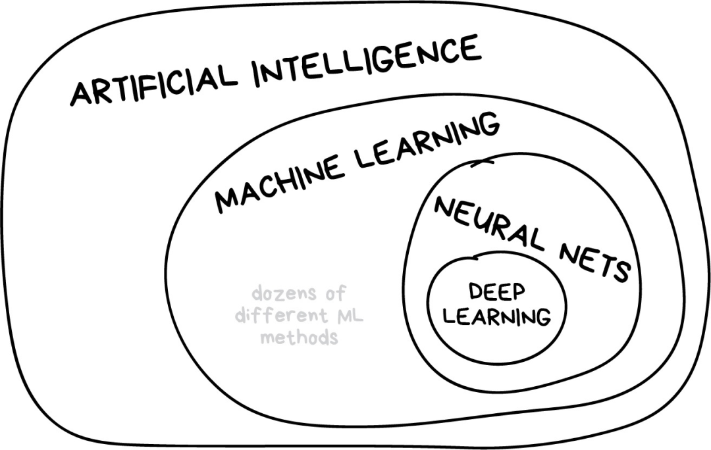

# Learn AI

## 智能（Intelligence）
可以通过下面这段话来理解智能:
>The ability of an agent to perceive an environment and to choose actions that increase its chances of achieving its goals by learning, knowledge, reasoning, planning, etc.

涉及的主体有：agent（智能体）、environment（环境）、goal（目标）、action（行为）。

## 智能的分类
1. 自然智能（Natural Intelligence）：指的是智能体在自然界中生存、繁衍、进化的能力。
2. 人工智能（Artificial Intelligence）：指的是智能体在人工环境中，通过学习、知识、推理、计划等手段，实现其目标的能力，也就是这种智能是人类通过机器创造出来的，是一种复制natural intelligence的能力。

## AI相关概念的区分

* 人工智能: 整个学科的名称，类似于“生物学”或“化学”。根据智能的定义，人工智能可以定义为：The ability of a machine to perceive an environment and to choose actions that maximize the expected likehood of achieving a goal.
* 机器学习: 人工智能的重要组成部分，但不是唯一的部分。
* 神经网络: 是机器学习的一种分支方法，这种方法很受欢迎，不过机器学习大家庭下还有其他分支。
* 深度学习: 是关于构建、训练和使用神经网络的一种现代方法。本质上来讲，它是一种新的架构。在当前实践中，没人会将深度学习和“普通网络”区分开来，使用它们时需要调用的库也相同。
## AI的分类
1. Artificial Narrow Intelligence（ANI）：指的是能够模仿某个领域的智能，如图像识别、语音识别、自然语言理解等。
2. Artificial General Intelligence（AGI）：指的是能够模仿人类的智能，包括机器人、自然语言处理系统、机器学习系统等。
3. Artificial Super Intelligence（ASI）：指的是能够超越人类的智能，包括人工智能、超级计算机、虚拟现实等。
目前存在的AI都是ANI，但未来可能会出现AGI、ASI。

## 人工智能重要的组成部分 
1. Perception
2. Learning
3. Kowledge
4. Reasoning
5. Planning

## 人工智能的发展的阶段
1. Classical AI (C-AI)
2. Knowledge-based AI (K-AI) 
3. Data-driven AI (D-AI), limitation: Lacks the ability to reason, requires labeled data, only learn what you teach it
  
## 参与人工智能的方式
1. Training Models: 训练模型，通过大量的数据训练模型，使模型具备智能。
   * Training via data set: 对数据集的收集、清洗、组织、加标记
   * Training via simulation
   * Training via demonstration
2. Build App using Pre-trained Models: 使用预训练模型，通过API接口调用，实现智能应用。
3. Build App using Custom Models: 训练模型，通过大量的数据训练模型，并进行优化，使模型具备智能。
4. Use AI Tools: 使用AI工具，如谷歌助手、微软小冰等。